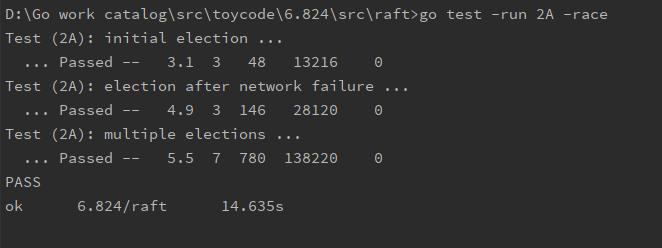
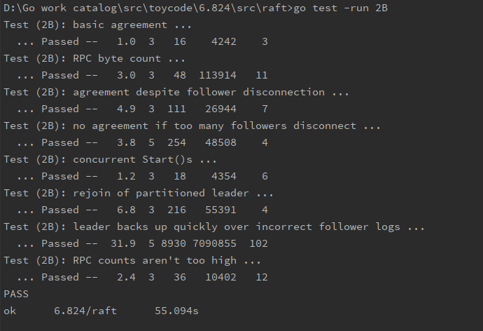
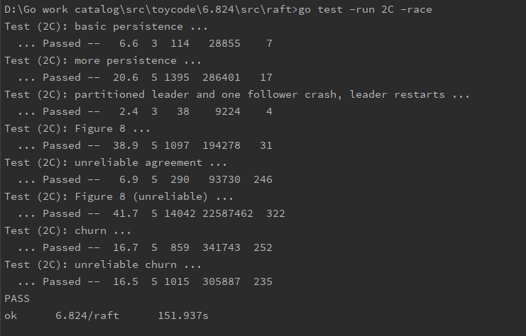
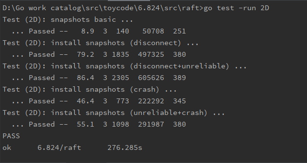

# MIT6.824-Lab2-Raft
implement of Lab2-Raft of MIT6.824

## Lab2A
执行命令`go test -run 2A -race`  

## Lab2B
执行命令`go test -run 2B`或者`time go test -run 2B`  

## Lab2C
执行命令`go test -run 2C -race`  

## Lab2D
执行命令`go test -run 2D`  
